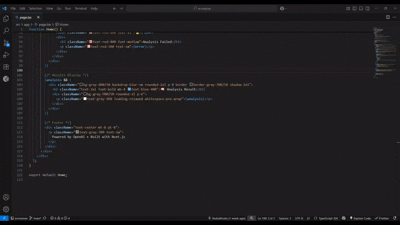

# ErrorSense

##  Features**ErrorSense** is a VS Code extension that provides instant, AI-powered explanations for programming errors — right inside your editor. Select the  Code, then let ErrorSense explain it clearly and help you fix it faster.

But that's not all: ErrorSense is also powers a web version, so you can use it from any browser as a standalone programming assistant.

##  Demo



*ErrorSense in action - Select code, press Ctrl+Shift+E, and get AI-powered explanations*

---

But that’s not all: ErrorSense’s backend also powers a web version, so you can use it from any browser as a standalone programming assistant.

---

##  Features

- AI-powered explanations for error messages  
- Works on selected code or clipboard text  
- Presents detailed, beginner-friendly breakdowns  
- Supports error explanation **and** code optimization suggestions  
- Single webview panel inside VS Code for easy reading  
- Status bar button for quick access  
- Also usable as a web API for integration in your own apps or websites

---

##  Getting Started (VS Code Extension)

1. Install the extension from the marketplace or clone this repo and run it locally.  
2. Select the code.  
3. Click the “Explain Code button on the status bar or run the `ErrorSense: Explain Code` command.  
4. Or use the default keyboard shortcut: `Ctrl+Shift+E` (Mac: `Cmd+Shift+E`).
5. See the explanation appear in the side panel.
6. You can always customize the keyboard shortcut File > Preferences > Keyboard Shortcuts and type Errorsense.

---

##  Using the Web Version

You can also use the same ErrorSense AI via a web interface:

- Visit the deployed web app at: https://code-sense-nu.vercel.app/  
- Send code snippets to the API endpoint for explanations  

---

##  Development

This project was bootstrapped with [Next.js](https://nextjs.org) and uses the [OpenAI API](https://openai.com/api/) for AI-powered explanations.

To start the development server locally:

```bash
npm run dev
# or
yarn dev
# or
pnpm dev
